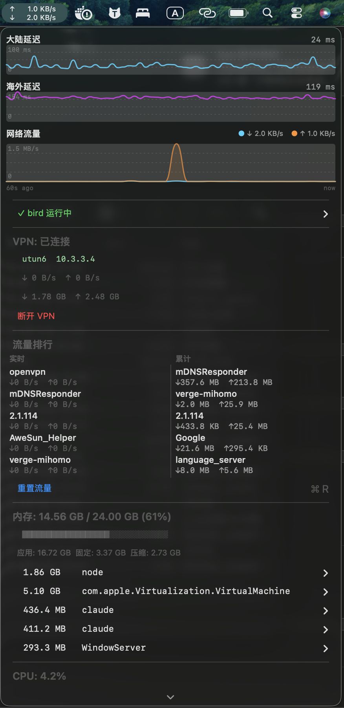

<div align="center">

# NetSpeed

[](https://github.com/any-leap/NetSpeed/stargazers)
[](https://github.com/any-leap/NetSpeed/releases/latest)
[](LICENSE)


**macOS 菜单栏系统监控，给使用 Clash TUN / VPN 的开发者 —— `ping` 不通的时代，用真实 HTTP RTT 告诉你链路好不好。**



[安装](#安装) · [功能](#功能) · [为什么需要它](#为什么需要它) · [English](README.md)

</div>

## 为什么需要它

市面上所有 macOS 系统监控工具用 ICMP `ping` 测延迟。Clash 在 TUN 模式下会劫持 ICMP —— 你看到的 "到 Google 3ms" **是假的**。更糟的是，裸 TCP connect 也会被 TUN netstack 短路：测到的是和你本地 Clash 的握手，不是真实服务器。

NetSpeed 用 Apple 官方的 `URLSessionTaskMetrics`（`responseEndDate − requestStartDate`）测真正端到端的 HTTP 往返。给你两条独立的曲线：

- **大陆延迟** —— 直连链路（.cn 网站）的健康
- **海外延迟** —— 代理节点到境外站点的健康

哪条卡了，一眼看出。

## 功能

- 📊 **定宽速度** —— 菜单栏 `↑ 上行 / ↓ 下行`，不跳动
- 🌏 **双延迟曲线** —— 大陆（Baidu/Taobao/QQ）+ 海外（gstatic `/generate_204`、Cloudflare、GitHub），5 分钟滚动窗口
- 🏆 **按进程流量排行** —— 实时 + 累计双栏，随时重置
- 🖥 **CPU / 内存** —— 各 Top 5 进程，菜单里可直接 kill
- 🚨 **CPU Guard 守护** —— 进程持续高 CPU 自动通知；监控关键进程（如 `bird`）崩溃时告警
- 🔐 **OpenVPN 控制** —— 菜单里连 / 断（配置过才显示）
- 🌍 **双语界面** —— 根据系统语言自动切换中/英
- 💧 **极低占用** —— 内存约 15 MB，空载 CPU <0.5%，延迟探测每天约 30 MB 流量

## 横向对比

|                         | NetSpeed | iStat Menus | Stats | MenuMeters |
| ----------------------- | :------: | :---------: | :---: | :--------: |
| 开源                    |    ✅    |      ❌     |   ✅  |     ✅     |
| 免费                    |    ✅    | 💰 US$12    |   ✅  |     ✅     |
| Clash TUN 下真实延迟    |    ✅    |      ❌     |   ❌  |     ❌     |
| 大陆 / 海外延迟分开     |    ✅    |      ❌     |   ❌  |     ❌     |
| 按进程流量（实时+累计） |    ✅    |      ✅     |   ❌  |     ❌     |
| CPU 异常通知            |    ✅    |      ❌     |   ❌  |     ❌     |
| OpenVPN 连接 / 断开     |    ✅    |      ❌     |   ❌  |     ❌     |

## 安装

需要 **macOS 14+** 和 Swift 5.9（装了 Xcode Command Line Tools 就有）。

```bash
git clone https://github.com/any-leap/NetSpeed.git
cd NetSpeed
make install
```

`make install` 会自动：编译 release → ad-hoc 签名 → 生成 LaunchAgent 用户 plist（含绝对路径）→ 启动。菜单栏图标立刻出现。

> 预编译的 `.dmg` 会在 v0.2.0 发布后挂到 [Releases](https://github.com/any-leap/NetSpeed/releases)。

### 开发工作流

```bash
make reload   # 重新编译 + 重启
make tail     # 实时追 stderr
make logs     # 最近 50 行 stderr
make stop / make start / make uninstall
```

日志位置：`/tmp/netspeed.log` 和 `/tmp/netspeed.err`。

### 注意事项

- `make install` 之后**不要移动目录** —— LaunchAgent plist 里是绝对路径。如必须移动，重新跑一次 `make install` 即可
- ad-hoc 签名足够本地运行；未来 Release DMG 同样是 ad-hoc（做完 Apple 公证之前）。首次下载运行可能需要**右键 → 打开**

## 架构

详见 [CLAUDE.md](CLAUDE.md)：

- 为什么 `make reload` 而不是 `swift run`
- `LSUIElement=true` 为什么用 linker flags 嵌入（SPM 的 workaround）
- 菜单 live-refresh 的 signature 机制（避免每 2 秒重建闪烁）
- Timer run-loop mode 坑（必须 `.common`，不然菜单打开时停跑）
- Clash TUN 具体踩过的坑（决定了现在的延迟测量方案）

## Roadmap

- [x] v0.2：双延迟图 + ops 基础设施（日志 / 签名 / Info.plist）
- [ ] v0.3：README + CI 发版流水线（本次）
- [ ] v0.4：拆 `App.swift` —— 抽出 `MenuBuilder` / `VPNController` / `NotificationHelper`
- [ ] v0.5：VPN 监控通用化 —— 检测任何 `utun` 接口，OpenVPN 控制变成可选；章节改名"Tunnel"
- [ ] v0.6：用原生 `libproc` / `host_statistics` 替换 `subprocess top/nettop`
- [ ] v1.0：提 Homebrew cask

## 贡献

欢迎 Issue / PR。提之前请先看看 [CLAUDE.md](CLAUDE.md) —— 里面有架构决策背景。

## License

[MIT](LICENSE)
